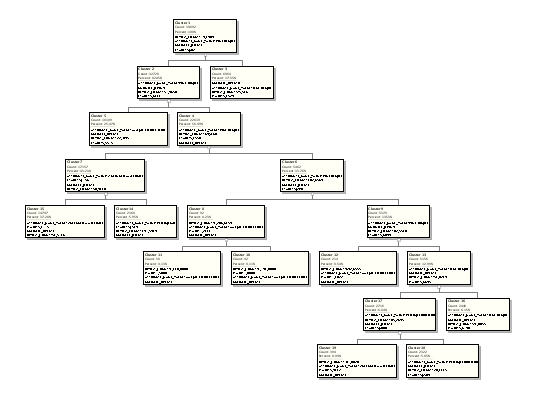
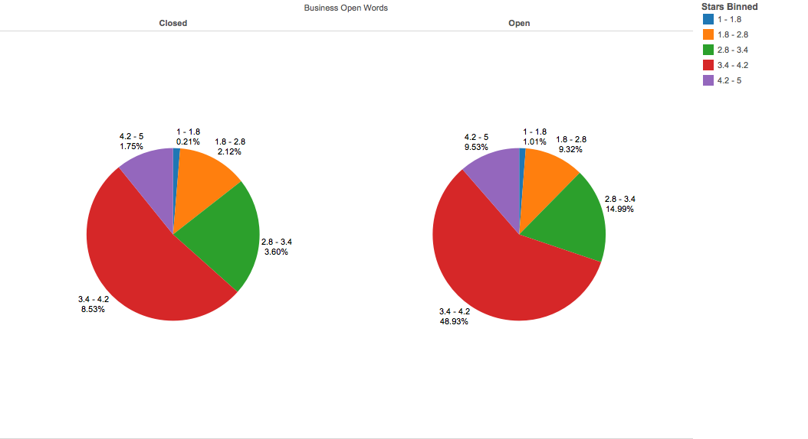

***
**This project analyzes data from the [Yelp Academic Dataset Challenge](https://www.yelp.com/dataset_challenge).**

The Challenge Dataset includes data from Phoenix, Las Vegas, Madison, Waterloo and Edinburgh:

42,153 businesses  
320,002 business attributes  
31,617 check-in sets  
252,898 users  
955,999 edge social graph  
403,210 tips  
1,125,458 reviews  

For our analysis, we focused mainly on the businesses which were categorized as restaurants, their attributes, features, categories, and reviews.

***

# Data Overview

  

The key features of the dataset for our analysis are as follows:

* Every Business has:
    + A list of attributes key-value pairs. These are things like BYOB - True, Allows Appointments - False.
    + A star rating, this is a real number in the range [1, 5], it is the average star rating of the business, although not necessarily the average of the reviews we have to the business.
    + A list of reviews, this is not every review associated with the business, only the ones that Yelp has chosen to publish with the dataset.
    + A boolean telling the perminant status of wehter the business is open or closed down.
    + A count of the number of reviews the business has.
* Every review has:
    + A star rating that is an natural number in the range [1, 5], this represents an individual rating.
    + A body of text that the user submitted with the review.

***
# The Analysis:
***

We attempted three distinct sets of analysis on the data set.

* ### Predicting if a restaurant is open
    + We attempt to predict whether or not a restaurant is open based on attributes of the business, such as whether or not it has a drive through, or is BYOB, open late, etc, along with star ratings.
* ### Predicting star rating of restaurants
    + We attempt to predict the overall star rating of restaurants, based on the same set of attribute as before, and whether or not the business is closed.
* ### Predicting review rating from review text
    + We used naltural language processing techinques to attempt to create classifiers that can predict the star rating of a review from its text.

***
# Predicting if a restaurant is open
***

We attempt to predict whether or not a restaurant is open based on attributes of the business, such as whether or not it has a drive through, or is BYOB, open late, etc, along with star ratings.

## Workflow

Our data miner workflow, including a few extra nodes and nodes for other section of our analysis:

  

***

## Clustering

We ran three clustering algorithms on the data, with the results shown here:

### KM Cluster

  

### EM Cluster

  

### OC Cluster

  

While those results are a little small, they effectively show no clusters of interest.

***

## Anomaly Detection

  

Our anomaly detection shows in the top results that the most anomalous features of a business were businesses that have low star counts. This is a very obvious result, which we will examine in detail in a later section.

***

## Classification

We also ran four classification algorithms on our data.

### GLM Classification

#### GLM Classified Open

  

#### GLM CLassified Closed

  

There are effectively no results here, but even if there were, the test results for the GLM Classification show:

  

Which means that this classifier is only slightly better than just randomly guessing the target value.

***

### SVM Classification

#### SVM Classified Open

  

Please note that the coefficients for the other target value are the negated coefficients for this target value.  

Now there are actually some correlated data points here, however the test results for the SVM Classification show:

  

That it is even worse than the GLM classifier at predicting whether or not a business is open, so these correlations don't mean much in the big picture.

***

### Naive Bayes Classification

#### Naive Bayes Classified Open

  

The classification results for the other target value are ommited due to lack of intersting information. 

We have two pretty good features that identify a business as open, however as we'll come to see in a bit, these aren't very interesting results.

For those unfamiliar with very basic probability theory, \<PRIOR\> refers to [the prior probability](http://en.wikipedia.org/wiki/Prior_probability) and is the least interesting result possible here.

As for the Naive Bayes test results

  

It does pretty ok at predicting wether or not a business is open, but once again, this isn't due to any particular insight in the data and will be clarified later.

***

### DT Classification

#### DT Classified Open

  

The decision tree unfortunately made prime use of the singularity of some of our data points by frequently for example targeting businesses with more than 178 reviews and less than 180 reviews to acheive good results.

  

It also does pretty well at predicting whether or not a business is open, but once again this isn't due to any particular insight into the data.

***
## Why None of this is Interesting
***

Here are a few visualizations of our dataset using the same clustering applied by data miner:

  

  

  

As you can see, it simply doesn't matter whether or not a business is open in terms of it's star count, they are distributed nearly evenly and every feature that was marked as significant is either the dominant feature or non existant.

Our anomaly detection showed that businesses with low star ratings are anomalous, well of course they are, less than a percent of businesses have a star rating of less than 1.8.

Our Naive Bayes classifier just estimated that the most likely feature was the existance of a star count between 3.4 and 4.2. Once again, of course it does, more than half of all businesses fall in that range, whether they are open or closed.

***
## Conclusion
***

Whether or not abusiness is open cannot be predicted by its features ( please note they didn't even show up on the classification builds, this is because they are at the bottom of the list in terms of classification power for every classifier), star rating, and review count.

***
# Predicting a Restaurant's Star Rating
***

In this section, we attempt to predict the overall star rating of restaurants, based on the same set of attribute as before, and whether or not the business is closed.

Instead of trying to give an actual star rating (which is a real number in [1, 5]) we have binned the stars into the following groups:
* < 1.8
* >= 1.8, < 2.8
* >= 2.8, < 3.4
* >= 3.4, < 4.2
* > 4.2

And we attempt to place a business into a bin. This is for simplicity's sake, as trying to point out an exact value for star rating is pointless.

## Workflow

Our data miner workflow, which is mostly the same as the previous workflow, just with some different transforms and different targets:

  

***

## Clustering

We ran three clustering algorithms on the data, with the results shown here:

### KM Cluster

  

### EM Cluster

  

That doesn't even make sense.

### OC Cluster

  

While those results are a little small and hard to read, they show no clusters of interest.

***
## Classification

We also ran four classification algorithms on our data. In this section, our classifiers were targeting one of 5 possible values, so in an attempt at brevity, we're leaving our the results for four of the five target values for each classifier.

### SVM Classification

#### SVM Classified >= 3.4, < 4.2

  

There is not a single feature that is a strong predictor in the SVM classifier, and the results reflect that:

  

This was actually a waste of machine resources to run.

***

### Naive Bayes Classification

#### Naive Bayes Classified >= 3.4, < 4.2

  

We have a few pretty good features that identify a business as >= 3.4, < 4.2 stars, however one is entirely uninteresting, and the others are bizzare and don't tell us much about the data.

Once again, for those unfamiliar with very basic probability theory, \<PRIOR\> referes to [the prior probability](http://en.wikipedia.org/wiki/Prior_probability) and is the least interesting result possible here.

As for the Naive Bayes test results

  

It doesn't do nearly as well predicting star ratings as it does whether or not a business is open.

***

### DT Classification

#### DT Classified >= 3.4, < 4.2

  

The decision tree once again unfortunately made prime use of the singularity of some of our data points by frequently for example targeting businesses with more than 178 reviews and less than 180 reviews to acheive good results.

  

It also didn't do quite as well at predicting a business's star rating.

***
## The Features That Did Matter
***

The only important factors that the classifications determined were valuable for each star rating bin was that the business was open (the vast majority are) and the it has one of the following list of attributes:

  

As you can see, a fair number of these attributes are complementary, for instance AcceptsCreditsCards0 and AcceptsCreditCards1 which means that the business either does or doesn't accept credit cards.

***
# Predicting the Star Rating of a Review From the Text of the Review
***

We used naltural language processing techinques to attempt to create classifiers that can predict the star rating of a review from its text.

## Workflow

Our data miner workflow:

  

***

## How to perform textual analysis in data miner

You must run a data source with textual data to a Build Text node. On the Build Text node, find the column that contains your text and click the plus sign on the top. The default options in the dialog that pop up are probably fine.

You might with to adjust the Max number per document and Max number accross all documents settings, as they might be too small for your dataset, but increasing them will slow down the processing by a bit.

You can then run that Build Text node into anomaly detection, classifiers, etc, as you please.

***

Unfortunately, configuration errors and time-out errors have stopped us from showing the anomaly detection and classification builds that are shown in the workflow, however we were able to replicat the naive bayes classifier in python to run our own analysis.

From our analysis, a naive bayes classifier on tokenized review text should acheive an overall accuracy of 63.46%, which is pretty darn good considering how noisy the data is.

In particular, 4 star ratings are difficult to classify because people will just mark 4 as their personal default and then put how they actually feel in the text, leading to a wide variety of tokens. Our classifier frequenty classified 4 star reviews as 2, 3, or 5 stars.

All in all, this was the most successful data mining that we were able to perform, although we had some issues setting it up and getting the output to function.

***
# Further Potential Analysis on Yelp Data
***

* We had data on the web of friend connections and fan counts for users that could be analyzed.

* We had data on votes, business hours, check-in activity, and user compliments that we were unsure of what to do with and didn’t look into.

